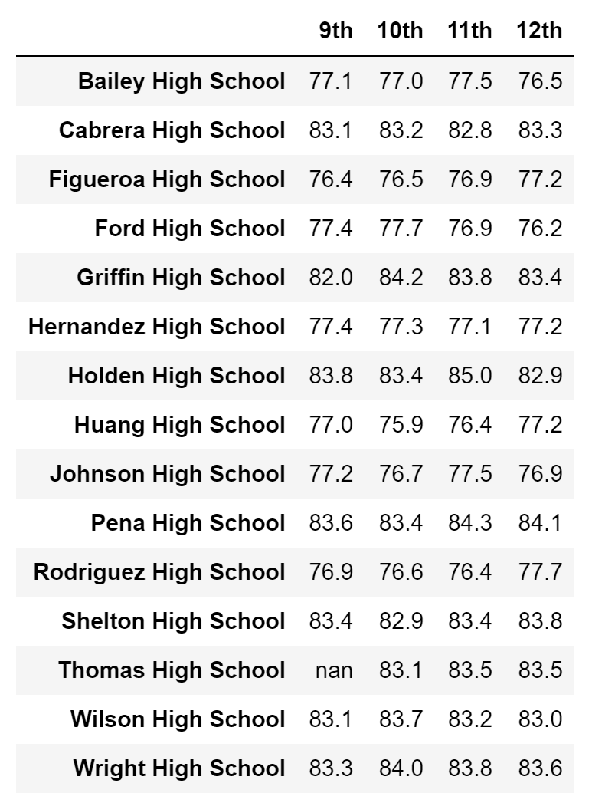
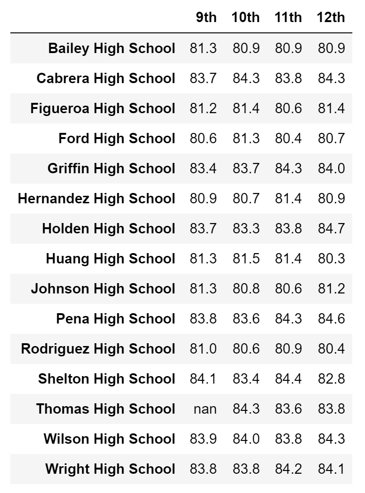
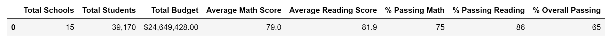
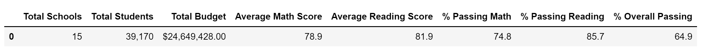
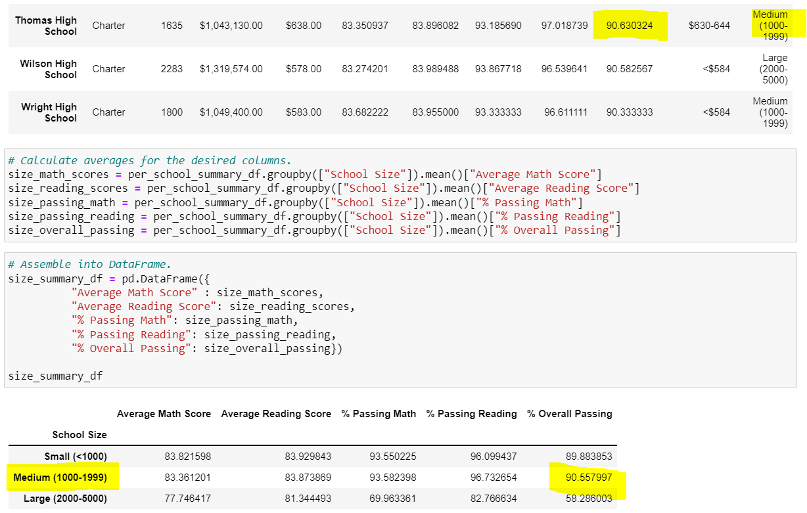
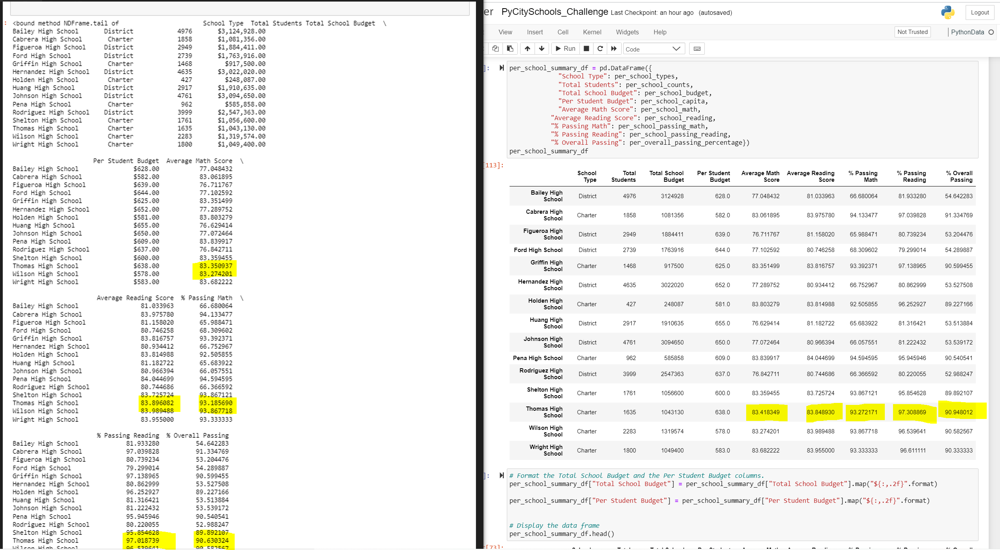

# School_District_Analysis

## Overview
The purpose of this analysis was to gather data from multiple high
schools across several districts, analyze the passing rates of students' 
reading and math standardized test scores, and determine the overall
school's performance based on funding/budget per student.  

## Results

* In Deliverable 1, we changed the 9th grade reading and math scores
at Thomas High School to NaNs due to inaccurate data. 

* In Deliverable 2, the average scores and passing percentage in the district 
summary DataFrame changed slightly with the changes made (Changing 9th grade 
THS scores to NaNs) in deliverable 1.

* The School Summary DataFrame shows the average scores and passing
percentage in relation to the Per Student Budget.

* Replacing the 9th graders scores at THS slightly decreased the overall 
performace but still remained one of the highest performing school.

* Replacing the 9th grade scores affects:
	
	- The Math and Reading Scores by grade was unaffected and the 
	9th graders at THS scores were replaced with NaNs.
	
	- THS had a higher passing overall percentage than what was average
	in the spending per student category. 
	
	- THS scores by school size was average for the expected passing rate 
	for a medium sized school. 

	- Thomas High School's scores were in line with the average scores
	for its school type (Charter).

## Summary
The overall math and reading scores, math and reading passing percentage, 
and overall passing percentage decreased when I replaced all the 9th graders
at THS scores with NaNs. In addition, the new district summary's scores and
percentages are slightly lower than the originl district summary in the 
PyCity Schools DataFrame. 

